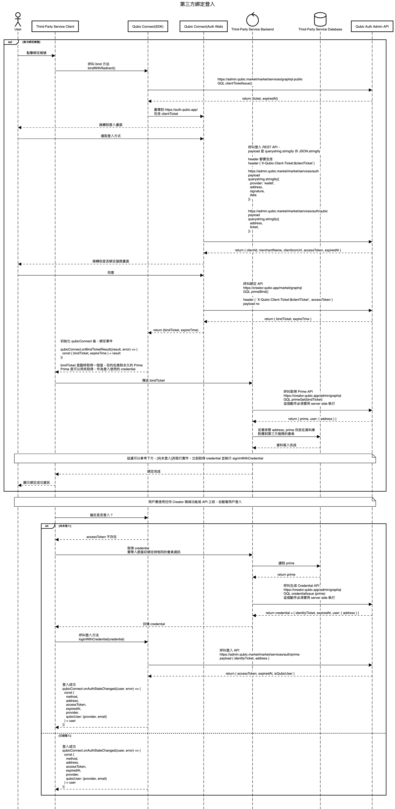

# Qubic Connect SDK

## Prerequisites

Before getting started, you need to setup a project for allow domain, api key/secret you need and other stuff.
https://admin.qubic.market/developer

## Installation

### Install from NPM

```cli
npm install @qubic-connect/core
```

```cli
yarn add @qubic-connect/core
```

### Install from CDN

```ts
<script type="text/javascript" src="https://unpkg.com/@qubic-connect/core"></script>

<script type="text/javascript" >
const qubicConnect = QubicConnect.initialize({
  name: 'Display Name', // will show up in display
  key: 'API_KEY',
  secret: 'API_SECRET',
});
</script>
```

## Examples

[https://qubic-connect-example.netlify.app/](https://qubic-connect-example.netlify.app/)

### Intranet examples

[https://staging--qubic-connect-example.netlify.app/](https://staging--qubic-connect-example.netlify.app/)

[https://develop--qubic-connect-example.netlify.app/](https://develop--qubic-connect-example.netlify.app/)

## Usage - User Auth

### Common types

```ts
type LoginRedirectWalletType = 'metamask' | 'qubic' | 'walletconnect';

type QubicSignInProvider = 'facebook' | 'google' | 'apple' | 'yahoo';

interface WalletUser {
  method: ExtendedExternalProviderMethod;
  address: string;
  accessToken: string;
  expiredAt: number;
  provider: ExtendedExternalProvider | null; // followed provider api on https://docs.metamask.io/wallet/reference/provider-api/
  qubicUser: QubicUser | null; // only Qubic Wallet User has this field
}

// when use loginWithRedirect the method will always be `redirect`
type ExtendedExternalProviderMethod = 'metamask' | 'qubic' | 'walletconnect' | 'custom' | 'redirect';

enum QubicUserProvider {
  GOOGLE = 'GOOGLE',
  FACEBOOK = 'FACEBOOK',
  TWITTER = 'TWITTER',
  APPLE = 'APPLE',
  UNKNOWN = 'UNKNOWN',
}

export interface QubicUser {
  provider: QubicUserProvider;
  email: string;
}
```

### Initialize Qubic Connect

In React, you should initialize it in global or context.

```ts
import QubicConnect from '@qubic-connect/core';

const qubicConnect = new QubicConnect({
  name: 'Display Name', // will show up in display
  key: 'API_KEY',
  secret: 'API_SECRET',
  trackGaSettings: [] // default: [], put measurement ids here to track addPaymentInfo event
  // 'enable' | 'qubic-only' | 'disable'
  autoLoginInWalletIabType: 'qubic-only', // default enable, it will auto login when url opened in Wallet dApp Browser which provides window.ethereum
});
```

### Direct sign in without wallet provider

Login with redirect

First of all, you need to add domain in https://admin.qubic.market/developer.
This setting is not only for api CORS domains, but also allow list for redirect domains.

For example, you can add `localhost:3000` for developing purpose.

```ts
function loginWithRedirect(options?: {
  walletType: LoginRedirectWalletType;
  qubicSignInProvider?: QubicSignInProvider;
}): void;
```

#### Example

```ts
// 1. will redirect page to choose all types of wallet
qubicConnect.loginWithRedirect()

// 2. sign in only with Qubic wallet
qubicConnect.loginWithRedirect({
  walletType: 'qubic'
});

// 3. sign in only with qubic wallet, and can only use google

qubicConnect.loginWithRedirect({
  walletType: 'qubic'
  qubicSignInProvider: 'google'
})

// 4.  sign in only with qubic metamask
// walletType: metamask has special flow
// if window.ethereum doesn't exist
// it will open https://metamask.app.link/dapp/$url
// in desktop, it will open metamask chrome extension page
// in mobile, if installed it will called metamask dapp browse
// in mobile, if not installed it will show google play or apple store page
qubicConnect.loginWithRedirect({
  walletType: 'metamask',
});
```

### Listen auth state changed

onAuthStateChanged will triggered when

1. User login success
2. User logout
3. User login success before it will persist user state, and hydrated from local storage when QubicConnect initialized

```ts
function onAuthStateChanged(callback: (result: WalletUser | null, error?: Error) => void): () => void;
```

#### Example

```ts
qubicConnect.onAuthStateChanged((user, error) => {
  if (error) {
    console.log(error.message);
  }
  if (!user) {
    console.log('user not logged in');
    return;
  }
  console.log('user logged in');
  console.log(user.address);
  console.log(user.accessToken);
  console.log(user.expiredAt);
});
```

### Bind with redirect

Bind with redirect

```ts
async function bindWithRedirect(options?: {
  walletType: LoginRedirectWalletType;
  qubicSignInProvider?: QubicSignInProvider;
}): Promise<void>;
```


Generated from [third-party-bind.md](docs/third-party-bind.md)

#### Mock Client Server

[Server Example Code](https://github.com/aimichen/qubic-prime-bind-server)

##### Prod

https://primebindprod-oad7xixtwq-de.a.run.app
https://credentialissueprod-oad7xixtwq-de.a.run.app

#### Intranet

##### Stag

https://primebind-oad7xixtwq-de.a.run.app
https://credentialissue-oad7xixtwq-as.a.run.app

##### Dev

Only works in internal server

we don't have mock client server for dev environment, need to use docker to run locally

```cli
docker pull aimi/qubic-prime-bind-server:commit-63d0994
docker run -it --rm -p8080:80 aimi/qubic-prime-bind-server:commit-63d0994 build/local_web_server
cd examples/example-pure-js
yarn start:dev
```

#### Example

```ts
// bind with redirect
qubicConnect.bindWithRedirect();

// when success redirect from url
qubicConnect.onBindTicketResult((bindTicketResult, error) => {
  console.log('example onBindTicketResult');
  if (error) {
    console.log(error?.message);
  }
  console.log({ bindTicketResult });
});
```

### Get current user

```ts
function getCurrentUser(): WalletUser | null;
```

#### Example

```ts
const user = qubicConnect.getCurrentUser();
```

## Usage - URL

### Qubic Wallet collectible url

Only Qubic Wallet user will get valid url string, otherwise it's null

```ts
function getUserQubicWalletUrl(options?: {
  walletUrl?: string; // default value: 'https://wallet.qubic.app'
  nextPath?: string; // default value '', ex: '/assets/list'
}): string | null;
```

#### Example

```tsx
const url = useMemo(
  () =>
    qubicConnect.getUserQubicWalletUrl({
      nextPath: '/assets/list',
    }),
  [],
);

return <a href={url}>View Collectibles</a>;
```

### Qubic Pass url

Will redirect to Qubic Pass url, and restrict it can be only sign in with the same account.
If not logged in, will return null.

```ts
function getUserQubicPassUrl(options?: {
  passUrl?: string; // default value: 'https://pass.qubic.app'
  nextPath?: string; // default value '', ex: '/home'
}): string | null;
```

#### Example

```tsx
const url = useMemo(
  () =>
    qubicConnect.getUserQubicPassUrl({
      nextPath: '/home',
    }),
  [],
);

return <a href={url}>View Pass</a>;
```

## Usage - Payment

### Payment types

```ts
// asset

enum BuyStatus {
  SUCCESS = 'SUCCESS',
  WAIT_PAYMENT = 'WAIT_PAYMENT',
  FAILED = 'FAILED',
}
interface PayCallbackInput {
  successRedirectUrl: string;
  failureRedirectUrl: string;
  pendingRedirectUrl: string;
}
```

### buyAssetAndCreateCheckout

```ts
async function buyAssetAndCreateCheckout(
  assetBuyInput: AssetBuyInput,
  options?: AssetBuyOptions,
): Promise<AssetBuyResponse | null>;

interface AssetBuyInput {
  requestId: string;
  asset: AssetSaleInput;
  payCallback: PayCallbackInput;
  test?: boolean; // default false
  option?: AssetBuyOptionInput;
}

interface AssetSaleInput {
  assetVariantId: string;
  quantity: number;
  price: string;
  currency: CurrencyForAsset;
}

enum CurrencyForAsset {
  ETH = 'ETH',
  TWD = 'TWD',
  MATIC = 'MATIC',
}

interface AssetBuyOptionInput {
  beGift?: boolean;
  privateSaleCode?: string;
}

interface AssetBuyOptions {
  locale?: PaymentLocale;
}

interface AssetBuyResponse {
  assetBuy: AssetBuyInfo;
}

enum CheckoutPaymentType {
  UNSELECTED = 'UNSELECTED',
  FREE = 'FREE',
  CREDIT_CARD = 'CREDIT_CARD',
  TRANSFER = 'TRANSFER',
  CRYPTO = 'CRYPTO',
}

enum UnavailablePaymentReason {
  GAS_PRICE_SURGE
  PAYMENT_LIMIT_EXCEEDED
  EXCHANGE_PRICE_FAILED
  PAYMENT_MAINTENANCE
}

type UnavailablePayment {
  type: CheckoutPaymentType!
  reason: UnavailablePaymentReason!
}

interface AssetBuyInfo {
  status: BuyStatus;
  orderId: string;
  paymentUrl: string;
  paymentTypes: [CheckoutPaymentType!]!
  unavailablePayments: [UnavailablePayment!]!
}
```

#### Example

```ts
const response = await qubicConnect.buyAssetAndCreateCheckout(assetBuyInput, { locale: 'zh' });

window.location.href = response.assetBuy.paymentUrl;
```

### giftRedeem

```ts
function giftRedeem(giftRedeemInput: GiftRedeemInput, options?: GiftRedeemOptions): Promise<GiftRedeemResponse | null>;

interface GiftRedeemInput {
  requestId: string;
  // valid giftCode should be `^[A-HJ-NP-Z]{8}$`
  giftCode: string;
  payCallback: PayCallbackInput;
}

interface GiftRedeemOptions {
  locale?: PaymentLocale;
}

interface GiftRedeemResponse {
  giftRedeem: GiftRedeemInfo;
}

interface GiftRedeemInfo {
  status: BuyStatus;
  orderId: string;
  paymentUrl: string;
}
```

#### Example

```ts
const response = await qubicConnect.giftRedeem(giftRedeemInput, { locale: 'zh' });

window.location.href = response.giftRedeem.paymentUrl;
```

### Error Code

[Payment](packages/core/src/constants/errorCodes.ts)

## Other Service API

### Verify access token on the server side

#### GET /verify

```ts
https://auth.qubic.app/verify?access_token=${accessToken}&service=qubic-creator
```

_response example_

```ts
{
  "scope": "qubic-creator",
  "client_id": "9999",
  "address": "0x6CE72a0Db7534C286fF7b1C6D83028389aa17e56",
  "expires_in": 3596
}
```

## Related Repo

[https://github.com/getamis/qubic-auth](https://github.com/getamis/qubic-auth)
