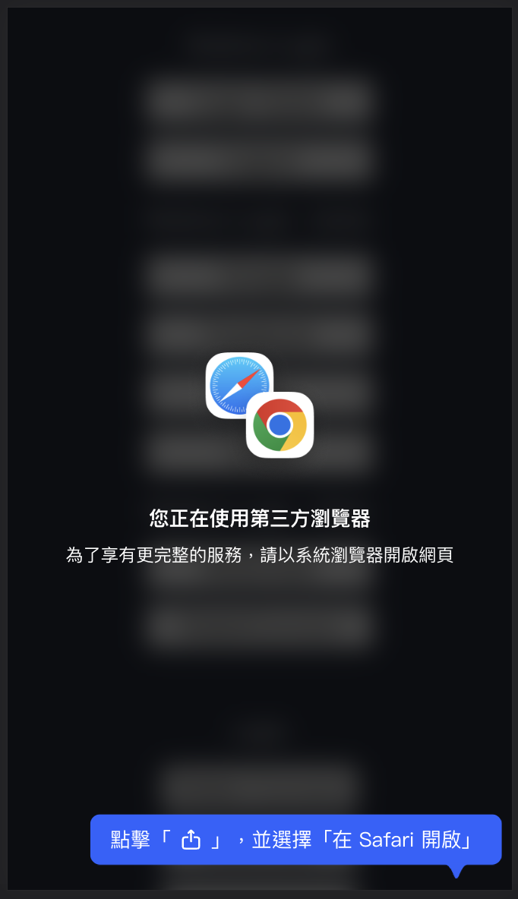
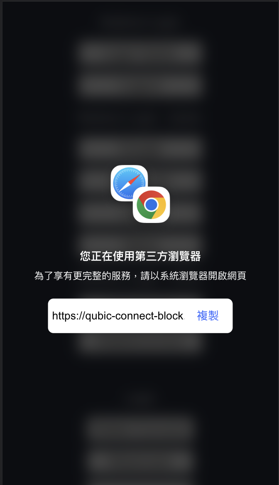
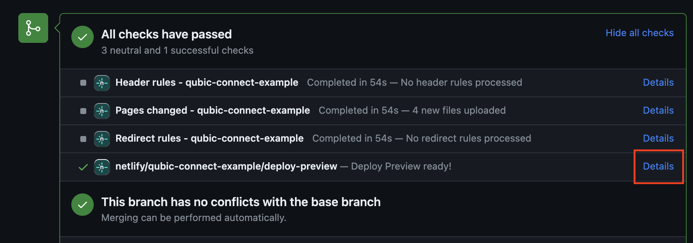

# `detect-iab`

> TODO: description

## Usage

import { showBlockerWhenIab, openExternalBrowserWhenLineIab } from '@qubic-connect/detect-iab';

### showBlockerWhenIab({ redirectUrl?: string, shouldAlwaysShowCopyUI?: boolean }): void
shows a blocker when detected in iab

shows relative hint when in instagram (due to maintaining reason we support only instagram now)

shows a copy box when not in instagram, or when `shouldAlwaysShowCopyUI` is true

if `redirectUrl` is given, show and copy `redirectUrl` instead of current url
### openExternalBrowserWhenLineIab(): void

when in line iab, auto opens native browser (chrome / google for android, safari for ios) with same url

## Preview deploy
After sending a PR，a link will be created after netlify generates a deploy-preview website

Post in on apps to preview PR's work